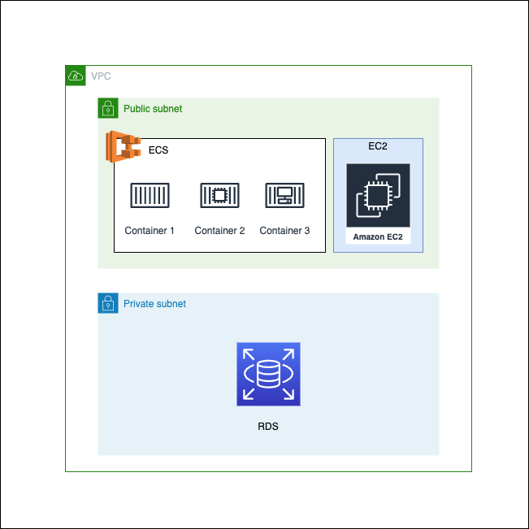

# Infrastructure as Code and Continuous Deployment Project with AWS, Terraform, and GitHub Actions

## Description

This project is designed as an end-to-end solution for deploying modern applications in the cloud. It uses Terraform to automate the creation and management of resources on AWS, including EC2 for computing, RDS for databases, and ECS for container orchestration.

### Why EC2, ECS, and RDS?

- **EC2 (Elastic Compute Cloud)**: Used to demonstrate database connectivity capabilities, in this case, to RDS. EC2 offers flexibility and complete control over our computing resources, making it the ideal choice for hosting our application and establishing a secure connection with the RDS database.

- **ECS (Elastic Container Service)**: This service is used to demonstrate that the CI/CD Pipeline, created using GitHub Actions, works as expected. ECS allows running applications in containers in a highly scalable and high-performance manner, which is especially useful for applications with microservices architectures.

- **RDS (Relational Database Service)**: Provides relational databases that are easy to set up, operate, and scale. RDS is used here as the data back-end for our application and is accessible from the EC2 instance.

These tools are not only robust but also highly compatible with each other, making integration seamless and efficient.



## Table of Contents

- [Requirements](#requirements)
- [AWS Configuration](#aws-configuration)
- [GitHub Actions Configuration](#github-actions-configuration)
- [Terraform](#terraform)
- [Docker](#docker)
- [Usage](#usage)
- [Contribute](#contribute)

## Requirements

- Terraform
- AWS CLI
- Docker
- GitHub

## AWS Configuration

The project creates multiple resources on AWS, detailed in the following sections.

## GitHub Actions Configuration

The `.github/workflows/cicd.yml` file configures a GitHub Actions workflow for building and deployment.

## Terraform

Infrastructure as code is managed through Terraform files.

### Terraform Variables

Variables are defined in `variables.tf`.

### Terraform Outputs

Outputs are defined in `outputs.tf`.

## Docker

The `Dockerfile` in this project is set up to create a Docker image that serves as a complete development environment. This image is based on Ubuntu and comes pre-configured with a set of tools and services that facilitate the development and deployment of applications.

#### What the Dockerfile Does:

1. **Uses Ubuntu as Base Image**: This is the operating system on which all the tools and services will be installed.

2. **Installs Basic Utilities**: Includes tools like `wget`, `curl`, `gnupg`, and `lsb-release` to facilitate downloading and installing additional packages.

3. **Installs Git**: An essential tool for version control.

4. **Installs Visual Studio Code**: A widely used source code editor, which will be useful for development.

5. **Installs Maven**: A project management and comprehension tool, especially useful for Java projects.

6. **Installs PostgreSQL and its Contribution**: An open-source relational database that will be used as the data storage system.

7. **Installs Java JRE**: The Java Runtime Environment, necessary for running Java applications.

8. **Installs .NET Core SDK**: The .NET Core SDK will allow the compilation and running of .NET Core projects.

9. **Installs Apache and Displays "Hello World"**: An Apache web server is installed and configured with a home page displaying "Hello World".

10. **Exposes Ports 80 and 5432**: Port 80 is exposed for the Apache web server and port 5432 for PostgreSQL.

11. **Starts PostgreSQL and Apache**: Upon starting the container, both the Apache web server and the PostgreSQL database service are automatically started.

#### Results:

- The created Docker image will be mounted on the selected compute service.
- You can use Git for version control.
- You can edit code with Visual Studio Code.
- You can manage Java projects with Maven.
- You will have a ready-to-use PostgreSQL database.
- You can run Java applications thanks to the installed Java JRE.
- You can compile and run .NET Core projects.
- You will have a running Apache server with a home page displaying "Hello World".

This Docker image is an end-to-end solution for developers, eliminating the need to manually install and configure multiple tools and services.

### Sample Projects in the Container

#### Java - Port 81

Within the `java_project` folder, there is a `Main.java` file that displays "Hello World Java" when accessed on the container's port 81.

#### Maven - Port 82

Within the `maven_project` folder, there is a basic Maven project that displays "Hello World Maven" when accessed on the container's port 82.

#### .NET - Port 83

Within the `net_project` folder, there is a .NET project that displays "Hello World .NET" when accessed on the container's port 83.

## Usage

### Step 0: Clone the Repository

Clone this repository onto your local machine.

```bash
git clone https://github.com/alexandropinna/arroyo-consulting-prueba.git
```

### Step 1: Configure Terraform Variables

Before deploying the infrastructure with Terraform, certain variables specific to your environment need to be configured. In this repository, you will find a `tfvars.example` file containing an example of the variables you need to configure.

#### How to use tfvars.example?

1. **Rename the File**: Copy the `tfvars.example` file and rename it to `terraform.tfvars`.

    ```bash
    cp tfvars.example terraform.tfvars
    ```

2. **Edit Variables**: Open `terraform.tfvars` with a text editor and modify the variables as per your needs. For example, replace the values for CIDR, subnets, and others according to your AWS configuration.

    ```bash
    virginia_cidr = "your_cidr_value_here"
    subnets = ["your_subnet_value_1_here", "your_subnet_value_2_here"]
    ```

    And so on for all the variables listed in `terraform.tfvars`.

3. **Save and Close**: Once you have finished editing the variables, save and close the file.

With these steps, your `terraform.tfvars` file will be ready to be used by Terraform for deploying the infrastructure.

### Step 2: Configure AWS Credentials

Make sure your AWS credentials are correctly configured.

### Step 3: Initialize and Apply Terraform

Initialize Terraform and apply the configuration.

```bash
terraform init
terraform apply
```

### Step 4: Trigger GitHub Actions

Make a push to the repository to trigger the GitHub Actions workflow.

```bash
git add .
git commit -m "Commit message"
git push origin main
```

## Author

- Alejandro Piña ([email](mailto:alexander.pinna@protonmail.com))